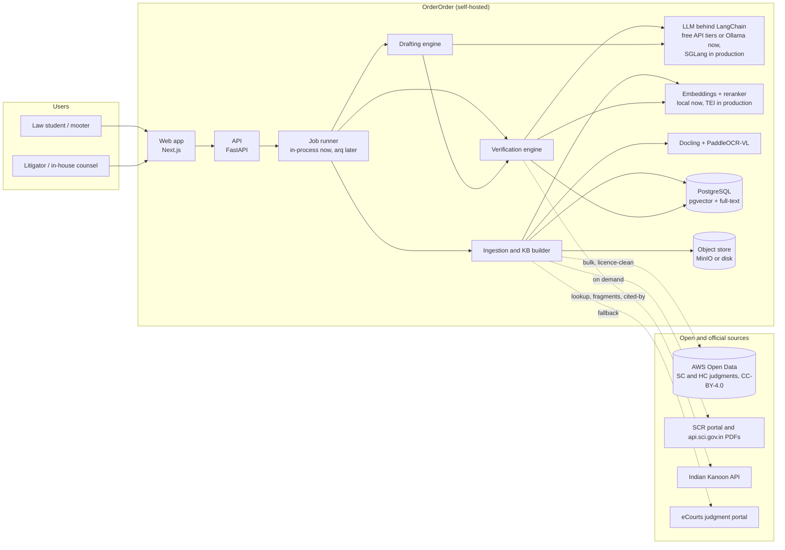
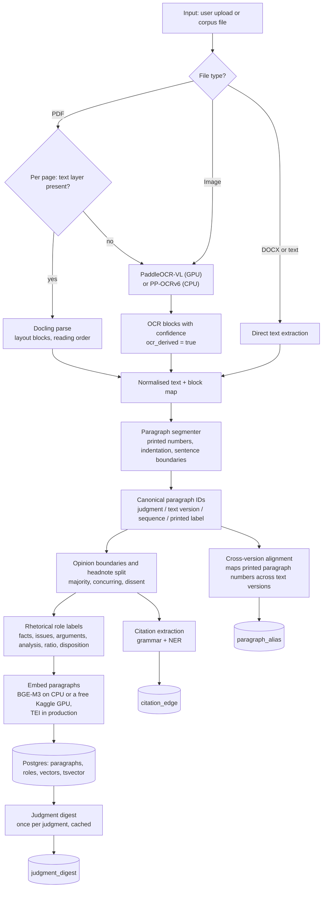
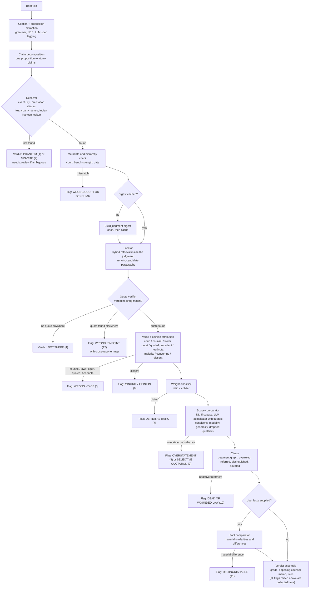
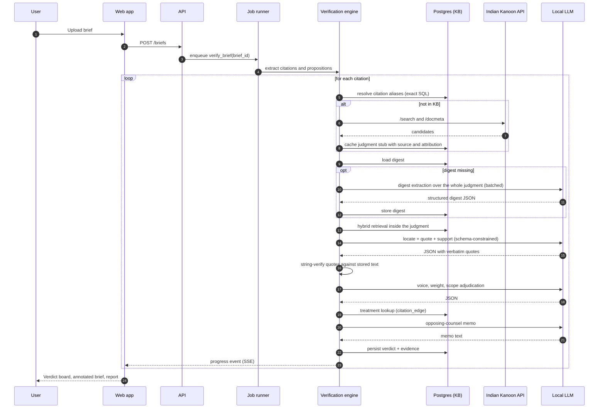
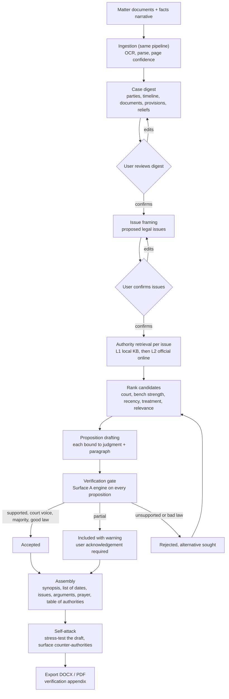
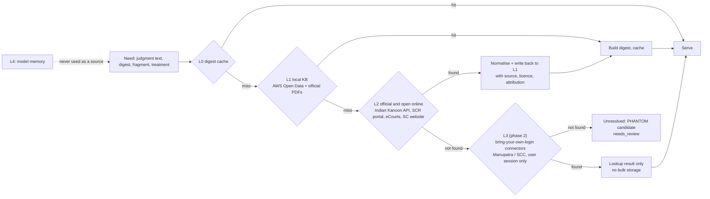
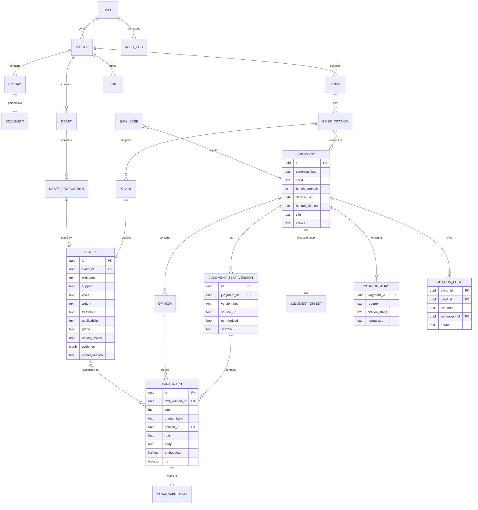
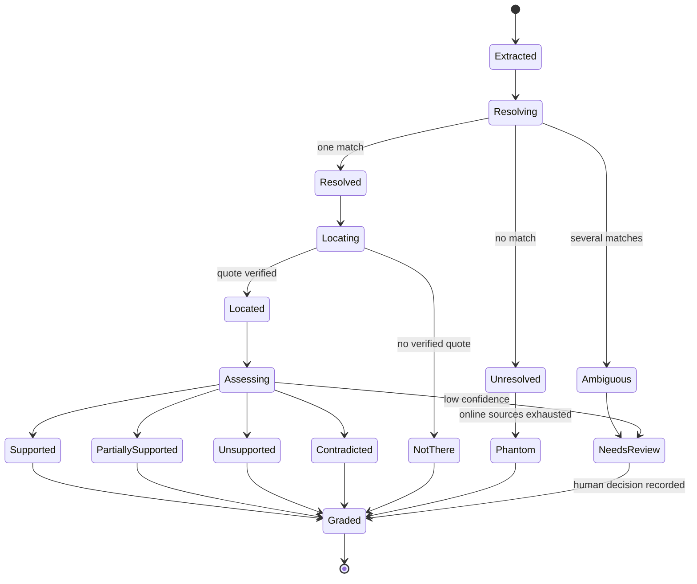
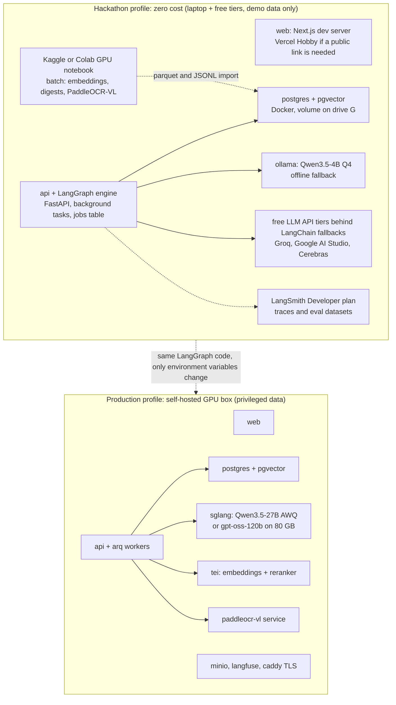

# OrderOrder — System Architecture

| | |
|---|---|
| **Version** | 0.1, draft |
| **Date** | 4 September 2026 |
| **Companion documents** | [PRD.md](PRD.md) · [TECH_STACK.md](TECH_STACK.md) · [ROADMAP.md](ROADMAP.md) |

This document specifies how OrderOrder is built: the ingestion pipeline and knowledge base, the verification engine that checks one citation at a time, the drafting engine that reuses it, the retrieval hierarchy, the data model, the verdict schema, deployment, and the evaluation harness. Diagram numbers are referenced from the other documents.

---

## 1. From principles to mechanisms

| Principle ([PRD](PRD.md) §5) | Mechanism |
|---|---|
| Quote-or-nothing | A `QuoteVerifier` string-matches every quote the model returns against the stored paragraph text. A verdict with `support` of `full` or `partial` and no verified quote fails validation and cannot be persisted (application check plus a database constraint). |
| Closed world | Prompts contain only retrieved paragraphs and digests. The resolver, not the model, decides which judgment a citation refers to. Prompts require the answer `not_found` when the supplied text does not contain the claim. |
| Three verdicts | Existence, location and support are separate pipeline stages with separate typed results and separate gold labels. |
| Adversarial | The memo prompt is written as opposing counsel's instructions; the grading rubric rewards weaknesses found. |
| Lawyer decides | No stage has side effects outside OrderOrder's own store; every export carries the disclaimer and the model version. |
| Auditable | Each verdict stores paragraph IDs, text version, quotes with offsets, source URL, retrieval trace, model and prompt version. |
| Temperature is not safety | Sampling is configuration. Correctness comes from retrieval quality, string verification and schema-constrained decoding. |
| Abstain | Every stage returns a typed result that includes `needs_review` with a reason code; the UI shows it as a first-class state. |

The engine is **deterministic code with language-model calls at the leaves**, not an autonomous agent. It is implemented as a LangGraph state graph (§4.13): each stage is a typed Python node, each decision is a conditional edge, and the verdict-in-progress is the graph state. Every LLM call goes through LangChain's model interface with a Pydantic output schema (`with_structured_output`), a prompt version and a logged trace; no node runs a ReAct-style tool loop.

---

## 2. System context



**Diagram 1.** Users reach the web app; the API enqueues work; workers run the three engines against the local knowledge base, the local LLM and the embedding service. External sources are reached only by the ingestion and resolver components, and everything fetched is normalised into the local store.

| Component | Responsibility | Package |
|---|---|---|
| Web app | Upload, verdict board, annotated brief, judgment viewer, drafting workspace, exports | `apps/web` |
| API | Auth, matters, uploads, jobs, verdict and draft endpoints, server-sent progress events | `apps/api` |
| Job runner | Long-running jobs: ingestion, verification, drafting, digest building; FastAPI background tasks with a jobs table for the hackathon, arq workers in production | `apps/api` |
| Ingestion and KB builder | Parsing, OCR, segmentation, roles, embeddings, digests, citation graph | `packages/ingest` |
| Verification engine | The per-citation pipeline (§4); pure Python, CLI-testable without the web app | `packages/engine` |
| Drafting engine | Case digest, issues, retrieval, propositions, gate, assembly, self-attack | `packages/engine` |
| LLM | Reached only through LangChain's model interface, so the provider is configuration: free API tiers with fallbacks for the hackathon, Ollama for offline development, SGLang for production; structured output via `with_structured_output` | config |
| Embeddings + reranker | BGE-M3 and bge-reranker-v2-m3 in-process on CPU for the hackathon (bulk corpus embedding on a free Kaggle GPU session), Text Embeddings Inference in production | in-process or container |
| OCR | Docling for born-digital pages; PP-OCRv6 on CPU for scans during the hackathon, PaddleOCR-VL on a free Kaggle GPU for batches or as a production container | in-process or container |
| PostgreSQL | System of record, vectors (pgvector), full-text (tsvector), citation graph | container |
| Object store | Original files, OCR output, rendered reports | MinIO or local disk |

---

## 3. Ingestion and knowledge-base build



**Diagram 2.** The same pipeline serves corpus building (AWS Open Data files, official PDFs) and user uploads (briefs, case documents). Routing is per page because Indian court PDFs are often hybrid: a typed order followed by scanned annexures.

### 3.1 Sources and text versions

A judgment can exist in several **text versions**: the AWS Open Data copy, the official PDF from `api.sci.gov.in`, an Indian Kanoon copy fetched on demand, a user-uploaded copy. Each version is stored separately with its source URL, licence, SHA-256 and an `ocr_derived` flag. The **official PDF is the preferred anchor** for pinpoints when available; otherwise the AWS Open Data copy. Verdicts always name the version they were resolved against.

Corpus build order for the hackathon: AWS Open Data Supreme Court parquet metadata first (fast, gives the citation alias table), then judgment text for the chosen year range, then official PDFs for judgments that appear in the demo memorial and the gold set.

### 3.2 Per-page routing

For each PDF page: extract the text layer; if characters per page are below a threshold (about 50-100) **and** image area covers most of the page, treat it as scanned. Also detect invisible OCR text layers (render mode 3) so that a previously OCR'd scan is not trusted blindly: re-OCR when the embedded layer's confidence is unknown and the page image is available.

### 3.3 Parsing

- **Born-digital pages**: Docling produces layout blocks (headings, paragraphs, footnotes, tables) in reading order. Footnotes are kept and linked to their anchors because Indian briefs cite in footnotes.
- **Scanned pages**: PaddleOCR-VL-1.6 on GPU (109 languages including Hindi/Devanagari); PP-OCRv6 on CPU for the laptop path. Blocks carry per-line confidence. Pages under a confidence threshold are flagged for the user in the UI.
- **DOCX and pasted text**: direct extraction preserving paragraph breaks and footnotes.

### 3.4 Paragraph segmentation and canonical IDs

Judgments are segmented into paragraphs using printed paragraph numbers where present ("23.", "(23)", "Para 23"), indentation and blank-line structure otherwise, with sentence-boundary repair for OCR text. Each paragraph receives a **canonical ID** made of the judgment ID, the text-version key, a sequence number, and the printed label if any. Sequence numbers are stable within a version; printed labels are never assumed unique or contiguous.

A **cross-version alignment** step aligns paragraphs between versions of the same judgment (sentence-level fuzzy alignment) and writes `paragraph_alias` rows mapping printed labels across versions with a confidence score. This is how the viewer can say "para 23 in SCC numbering corresponds to para 19 in the official text" once the SCC numbering is known from a user's pinpoint or a later mapping source.

### 3.5 Opinion boundaries and headnotes

Rules first, model second:

- Author signatures ("...J.", "C.J.I.", "(Dissenting)", "I have had the advantage of reading the judgment of my learned brother") mark opinion starts.
- A judgment with one author is a single majority opinion; multiple authors produce majority, concurring and dissenting opinions, labelled by the disposition each reaches.
- Editorial headnotes (present in some copies, typically before "JUDGMENT" or containing "Held:" summaries) are split off and labelled `headnote`; they are never treated as the court's words.
- A local-LLM pass confirms the boundaries on judgments where rules are uncertain, with the result cached in the digest.

### 3.6 Rhetorical roles

Each paragraph receives one of: `preamble`, `facts`, `lower_court`, `issues`, `argument_petitioner`, `argument_respondent`, `analysis`, `statute`, `precedent_relied`, `precedent_not_relied`, `ratio`, `disposition`, `none`. This is the OpenNyAI label set, chosen because `ratio`, `precedent_relied` and `precedent_not_relied` map directly onto the weight and voice checks.

- **Hackathon**: labels produced by the local LLM in batches of paragraphs with judgment context, schema-constrained, cached per judgment.
- **Phase 1**: a fine-tuned InLegalBERT classifier trained on the OpenNyAI rhetorical-role data plus LegalSeg, evaluated against the LLM labels and the gold set; the LLM stays as a fallback for low-confidence paragraphs.

### 3.7 Chunking and embeddings

The **paragraph is the chunk**. Each embedding input is the paragraph text prefixed with a short judgment context line (title, court, year, opinion type, role) so that paragraph vectors carry judgment-level meaning. Vectors are stored as `halfvec` in pgvector with an HNSW index; a `tsvector` column holds the full-text representation for BM25-style matching. Hybrid retrieval fuses both with reciprocal rank fusion. Citation strings are never looked up by vector search; they are exact-match SQL on the alias table.

### 3.8 The judgment digest

Computed once per judgment, cached forever, versioned by prompt and model:

```json
{
  "judgment_id": "uuid",
  "text_version": "sci_pdf:2019-02-14:sha256:ab12...",
  "court": "Supreme Court of India",
  "bench_strength": 3,
  "judges": ["..."],
  "opinions": [
    {"id": "op1", "author": "...", "type": "majority", "paragraph_range": [1, 88]},
    {"id": "op2", "author": "...", "type": "dissenting", "paragraph_range": [89, 131]}
  ],
  "decided_on": "2019-02-14",
  "neutral_citation": "2019 INSC 123",
  "parallel_citations": ["(2019) 4 SCC 1", "AIR 2019 SC 999"],
  "facts_summary": "...",
  "procedural_history": "...",
  "issues": ["..."],
  "holdings": [
    {
      "proposition": "A misrepresentation vitiates consent only where it induced the contract.",
      "conditions": ["the misrepresentation induced the contract", "the representee relied on it"],
      "modality": "must",
      "paragraph_ids": ["v1:41", "v1:42"],
      "quote": "verbatim sentence from paragraph 41",
      "opinion_id": "op1",
      "weight": "ratio",
      "statutes": ["Indian Contract Act 1872, s. 17", "s. 19"]
    }
  ],
  "disposition": "Appeal allowed.",
  "statutes_considered": ["..."],
  "precedents_relied": [{"canonical_key": "...", "paragraph_ids": ["v1:30"]}],
  "precedents_distinguished": [],
  "headnote_present": true,
  "ocr_derived": false,
  "digest_model": "qwen3.5-27b-awq",
  "digest_prompt_version": "digest-v2"
}
```

Every holding in the digest is itself quote-grounded: the `quote` field must string-match the referenced paragraphs or the holding is dropped and the judgment marked for review. The digest is what makes the engine affordable: a 300-page judgment is read in full once, by batch, and every later citation of it starts from the digest.

### 3.9 Citation graph extraction

While ingesting each judgment, the citation grammar and the NER model extract every case citation inside it and the paragraph where it occurs. A treatment classifier (cue phrases first: "overruled", "no longer good law", "referred to a larger bench", "distinguished", "followed", "relied upon", "doubted"; local LLM for the rest) labels each edge. These `citation_edge` rows, merged with Indian Kanoon's cited-by lists fetched on demand, form the citator used by the treatment check.

---

## 4. Verification engine



**Diagram 3.** One citation's path through the engine. Numbers in parentheses are the failure modes from [PRD](PRD.md) §6. Flags hang off the stage that raises them and accumulate on the verdict; terminal verdicts (phantom, not there) short-circuit. Every stage may also emit `needs_review`.



**Diagram 4.** Runtime sequence for Surface A. Steps that call the model carry a schema; the string-verification step (self-call on the engine) is where quote-or-nothing is enforced.

### 4.1 Citation and proposition extraction

1. **Grammar pass.** A hand-built citation grammar recognises the Indian reporter formats: `(YYYY) V SCC P`, `AIR YYYY SC P`, `[YYYY] V SCR P`, `(YYYY) V SCALE P`, `YYYY (V) JT P`, `YYYY INSC N`, High Court neutral citations `YYYY:PREFIX:N` (per-court prefix table, with `-DB` suffixes), Indian Kanoon document URLs, and the common variants (missing brackets, "SCC OnLine", "Supp"). Each match yields a normalised alias string.
2. **NER pass.** The OpenNyAI legal NER model's `PRECEDENT` entity catches case names without a reporter citation ("*Kesavananda Bharati*"), and `STATUTE`/`PROVISION` entities are recorded so that statute references are recognised and marked out of scope for verification.
3. **Proposition span.** For each citation the sentence or clause it supports is identified: the sentence containing the citation, or the preceding sentence when the citation stands alone ("See X v. Y."), or the footnote anchor's sentence. A local-LLM span tagger resolves the ambiguous cases and links a citation that supports several sentences.
4. **Pinpoint.** Any "para 23", "at p. 45", "paragraph 12-14" attached to the citation is captured as the **claimed pinpoint**.

### 4.2 Claim decomposition

The proposition is decomposed into **atomic claims**, each with: subject, predicate, conditions stated, modality (must / shall / should / may / observed / noted), generality (statute- or fact-specific vs general), and negation. "The Supreme Court has held that fraud vitiates all solemn acts, and that a party induced by fraud may avoid the contract and claim damages" becomes three atomic claims. The scope comparator works claim by claim, which is how "five things claimed, one thing said" is caught.

### 4.3 Resolver

Order of attempts, stopping at the first confident match:

1. Exact match of the normalised alias against `citation_alias`.
2. Neutral-citation match; year plus reporter plus page tolerance for OCR'd briefs (one-digit edits).
3. Party-name match with rapidfuzz (token-set ratio) against titles, filtered by year when a year is present, disambiguated by court and date; multi-stage matters (interim order, final judgment, review) are disambiguated by date and bench when the brief supplies them, otherwise flagged `ambiguous`.
4. Indian Kanoon `/search/` with the citation string and with the party names; `/docmeta/` for candidates; results cached as judgment stubs with source and attribution.
5. No match: `not_found`. The verdict is `PHANTOM` when the alias is well-formed and every source is silent; `MIS-CITE` when a party-name match exists under a different citation (the fix is offered).

The resolver never asks the model whether a case exists.

### 4.4 Metadata and hierarchy check

From the digest: court, bench strength, opinion types, date. Checks: the brief's attribution ("the Supreme Court held") matches the court; the citation is not being used against a larger-bench decision on the same point that the citator knows about; the judgment predates or postdates a statute the brief invokes. Hierarchy rules encoded as data: Article 141; larger benches bind smaller; High Court decisions bind within territory and persuade outside it; division bench over single judge; dissent never binding; obiter persuasive; `per incuriam` and `sub silentio` flags carried from the citator.

### 4.5 Locator and quote verifier

1. **Candidate retrieval** inside the judgment only: hybrid search (paragraph vectors + full-text) for each atomic claim, top 20, reranked to top 8; the claimed pinpoint's paragraph (and neighbours) is always added to the candidate set.
2. **Model pass**: the candidates, the atomic claims and the digest's holdings are given to the local LLM with a schema requiring, per claim, the best paragraph IDs and **verbatim quotes** (minimum eight words) copied from the candidates, or `not_found`.
3. **Quote verification** (pure code):
   - Normalise both sides: Unicode NFKC, whitespace collapse, quote and dash unification, soft-hyphen removal, footnote-marker removal, case-insensitive comparison; keep an index map back to original offsets.
   - Exact substring match in the cited paragraph gives `match_type: exact` with character offsets.
   - If the paragraph is OCR-derived, allow a fuzzy match (rapidfuzz partial ratio at or above 97) and record `match_type: fuzzy_ocr`; never fuzzy-match born-digital text.
   - If the quote is not in the candidate paragraphs, search the whole judgment text; a hit elsewhere becomes `WRONG PINPOINT (12)` with the located paragraph and the alias map; no hit anywhere becomes `not_found` for that claim.
   - A claim with no verified quote can never be `full` or `partial`.
4. **Pinpoint reconciliation**: the claimed pinpoint is compared with the located paragraph's printed label and its aliases in other versions; the verdict reports both ("you cited para 23; the supporting text is para 19 in the official text, which is para 23 in SCC numbering").

Indian Kanoon's `/docfragment/` endpoint provides a second opinion for judgments fetched from it: a keyword query built from the atomic claim returns the fragments Indian Kanoon finds, which are then quote-verified the same way.

### 4.6 Voice and opinion attribution

For each located paragraph:

- **Opinion**: from the opinion boundaries (majority, concurring, dissenting) computed at ingestion.
- **Voice**: rules plus model. Rules: paragraph role `argument_petitioner` / `argument_respondent` or cue phrases ("learned counsel submitted", "it was contended", "it is urged") mark counsel; `lower_court` role or "the High Court held" marks the court below; a quotation block introduced by "in *X v. Y* this Court observed" marks a quoted precedent (the words may still be endorsed; the model decides whether the citing court adopted them); the `headnote` label marks editorial text. The model's structured answer includes the endorsement decision ("quoted with approval" vs "quoted and rejected").

### 4.7 Weight: ratio versus obiter

Inputs: the paragraph's rhetorical role, its opinion, the digest's holdings, the disposition. The classification asks whether the proposition was necessary to the outcome (`ratio`), a remark not necessary to it (`obiter`), or `unclear`. There is no off-the-shelf model for this anywhere; the hackathon version is rule-assisted LLM classification with quotes, and the gold set grows the training data for a dedicated classifier.

### 4.8 Scope comparator

For each atomic claim with a verified quote:

1. **NLI first pass** (cheap): an entailment model scores claim against quote; strong contradiction or strong entailment short-circuits to the adjudicator with a prior.
2. **Adjudicator** (local LLM, schema-constrained): given the claim's structure (§4.2) and the holding extracted from the located paragraphs with its conditions and modality, it outputs:
   - `support`: `full`, `partial`, `none`, `contradicted`
   - `dropped_qualifiers`: conditions present in the holding but absent from the claim
   - `modality`: court's vs claim's ("may" vs "must")
   - `generality`: court's scope vs claim's scope ("Section 17" vs "all commercial contracts")
   - `gap`: one plain-language sentence
   - `narrowed_proposition`: a rewrite of the claim that the judgment does support
3. **Selective quotation**: when the brief quotes the judgment directly, the quoted span is compared with the full sentence in the source; a cut that removes a qualifier, proviso or "in the facts of this case" is flagged (9).

### 4.9 Citator

`citation_edge` rows (own extraction plus Indian Kanoon cited-by) are queried for the cited judgment. Treatment labels: `followed`, `relied_on`, `referred`, `distinguished`, `doubted`, `dissented_from`, `overruled`, `partly_overruled`, `reversed`, `affirmed`, `referred_to_larger_bench`, `statutory_supersession`. Negative treatment on the specific point (matched by the treating paragraph's content against the atomic claim) produces `DEAD OR WOUNDED LAW (10)` with the treating judgment and paragraph; negative treatment on a different point is reported as information. Bench strength of the treating court is checked so that a smaller bench "doubting" a larger bench is reported as doubt, not overruling.

### 4.10 Fact comparator

Only when the user has supplied facts (pasted narrative or a matter digest). Both fact sets are represented as fact elements (parties and relationship, transaction or event type, key events, statutory provisions, relief sought). The model lists shared material facts, differing material facts, and writes the distinguishing argument opposing counsel would make. Output: `applicability` of `strong`, `moderate`, `weak`, `inapplicable`; the hackathon version is a single structured LLM call over the digest's facts and the user's facts.

### 4.11 Verdict assembly, grade and memo

The grade is a rubric, not a model opinion: start at A; phantom or not-there is F; contradicted is F; wrong voice, dissent, or negative treatment on point drops to D; obiter, partial support, or wrong pinpoint drops one grade each; distinguishable drops one grade. The memo is generated last, from the verdict object only, in opposing counsel's voice, and is followed by concrete fixes (narrow the proposition to the `narrowed_proposition`; cite the pinpoint with both numberings; cite the larger-bench authority the citator found; acknowledge the distinguishing fact).

### 4.12 Abstention rules

`needs_review` with a reason code is returned when: the resolver has several plausible matches; the digest failed quote-grounding; the quote verifier only found fuzzy matches on born-digital text; the scope adjudicator's confidence is below threshold or disagrees with the NLI prior; the citator has conflicting treatments; OCR confidence on the located page is low. Reviewed verdicts are stored with the reviewer's decision and feed the gold set.

### 4.13 Implementation: the engine as a LangGraph state graph

The pipeline above is one LangGraph `StateGraph`. The state is the verdict-in-progress (the object in §8 plus working fields: candidate paragraphs, retrieval trace, flags). Each stage is a node; each decision in Diagram 3 is a conditional edge; the graph is compiled with a checkpointer so a brief's run survives a restart and every intermediate state is inspectable.

| Stage | Node | Kind | Reads | Writes |
|---|---|---|---|---|
| Extraction | `extract_citations` | Pure Python (grammar + NER); LLM only for ambiguous spans | brief text | citations, propositions, claimed pinpoints |
| Decomposition | `decompose_claims` | LLM, structured output | proposition | atomic claims |
| Resolver | `resolve` | Pure Python (SQL, rapidfuzz, Indian Kanoon client) | citation | existence, judgment id, candidates |
| Metadata check | `check_hierarchy` | Pure Python (rules table) | digest metadata | flags |
| Digest | `ensure_digest` | Cached; LLM chain over the whole judgment on a miss | judgment text | digest |
| Locator | `locate` | Hybrid SQL retriever + reranker, then LLM asked for quotes | atomic claims, paragraphs | candidate paragraphs, quotes |
| Quote verifier | `verify_quotes` | **Pure Python, no model** | quotes, paragraph text | verified quotes, offsets, match types |
| Voice and opinion | `attribute` | Rules first, LLM confirms | paragraph, opinion map | voice, opinion |
| Weight | `classify_weight` | Rules + LLM | role, digest holdings | ratio or obiter |
| Scope | `compare_scope` | NLI model, then LLM adjudicator | claim structure, holding | support level, gap, qualifiers |
| Citator | `check_treatment` | Pure Python (graph query) | citation edges | treatment |
| Facts | `compare_facts` | LLM, only when facts are supplied | user facts, digest facts | applicability |
| Assembly | `assemble` | Rubric in Python; LLM writes the memo text | everything | grade, memo, fixes |

Conditional edges: `resolve` routes straight to `assemble` on `not_found`; `verify_quotes` routes to `assemble` when no quote matches anywhere; `compare_scope` skips `compare_facts` when no facts were supplied. Any node may set `needs_review`, which raises a LangGraph interrupt so the run pauses for a human decision and resumes from the checkpoint. The graph runs once per citation and is mapped over a brief; a `Send`-style fan-out lets independent citations run concurrently within the provider's rate limits.

What this buys: the provider behind every LLM node is a configuration string with ordered fallbacks across free tiers; every node is a plain function that is unit-tested without a model; the graph's execution trace is the audit trail. What it does not change: the quote verifier and the resolver never call a model, and no node runs an agent loop.

---

## 5. Drafting engine



**Diagram 5.** Surface B. The only new logic is the gate; everything that checks a proposition is the Surface A engine unchanged.

- **Case digest** (from the matter's documents): parties and roles, relationship, timeline with document references, provisions invoked, reliefs sought, and a facts narrative. Quote-grounded to the uploaded documents in the same way judgment digests are grounded to judgments, so that a "fact" in the draft can be traced to a page.
- **Issue framing**: the model proposes issues from the digest; the user edits. Issues are stored as structured objects (question of law, provisions, relevant facts).
- **Authority retrieval**: per issue, hybrid search over digests and paragraphs (queries built from the issue and the relevant facts), then reranking; ranking features: court (SC over HC), bench strength, recency, treatment status from the citator, relevance score, and whether the judgment's facts match (fact comparator). Thin coverage triggers L2 lookups (§6) with write-back.
- **Proposition drafting**: for each issue the model writes propositions, each bound to one judgment and one or more paragraphs from the retrieved set; the schema forbids unbound propositions.
- **Gate**: each proposition is verified by the engine; policy per [PRD](PRD.md) B6. Rejections loop back to retrieval with the rejection reason so that the next candidate is tried.
- **Assembly**: Indian written-submission template (synopsis, list of dates, issues, arguments with headings per issue, prayer, table of authorities in SCC / neutral-citation style, verification appendix). Templates are files the co-founder owns.
- **Self-attack**: the assembled draft is run through Surface A; in addition, for each issue the engine searches for judgments with contrary holdings (queries built from the negation of each accepted proposition) and lists them as counter-authorities with their bench strength and treatment.

---

## 6. Retrieval hierarchy



**Diagram 6.** Every level is tried in order; every online fetch is normalised and written back into the local knowledge base with its source, licence and attribution, so the second user who cites the same judgment is served locally. Model memory is never a source.

| Level | Source | Access pattern | Quota and attribution |
|---|---|---|---|
| L0 | `judgment_digest` | In-process cache and table | — |
| L1 | Local KB built from AWS Open Data and official PDFs | SQL, pgvector, tsvector | CC-BY attribution in app footer |
| L2 | Indian Kanoon API (`/search/`, `/docmeta/`, `/doc/`, `/docfragment/`, cited-by lists) | Per-user daily quota; results cached as stubs | "Powered by IKanoon" wherever shown or used as context |
| L2 | SCR portal and `api.sci.gov.in` PDFs | On-demand fetch by neutral citation | Public record |
| L2 | eCourts judgment portal | Manual-assist fetch (CAPTCHA) in phase 1 | Public record |
| L3 | Manupatra / SCC Online via the user's own login (phase 2) | Browser extension or connector; lookup only | User's own subscription terms |
| L4 | Model memory | **Never** | — |

---

## 7. Data model



**Diagram 7.** Entity relationships. Judgments have many text versions; paragraphs belong to a version and an opinion; verdicts point at the paragraphs that evidence them; drafts are gated by verdicts.

Notes on the tables:

- `citation_alias.normalized` is the lookup key for the resolver (unique index); several aliases per judgment.
- `paragraph_alias` maps `(text_version_a, printed_label_a)` to `(text_version_b, printed_label_b)` with a confidence score; rows are produced by cross-version alignment and by user-confirmed pinpoints.
- `verdict.evidence` (JSONB) holds the full verdict object of §8; the scalar columns are denormalised for the board and for metrics.
- `judgment_digest` stores the JSON of §3.8 with `model` and `prompt_version`; a digest is rebuilt only when the prompt version changes.
- `eval_case` stores gold-set items (§11) and links to the judgment they target.
- `audit_log` records every access, export and verdict override with user, matter, object and timestamp.
- Per-matter isolation is enforced by row-level security keyed on `matter_id`.

---

## 8. Verdict schema

```json
{
  "verdict_id": "uuid",
  "claim_id": "uuid",
  "brief_citation_id": "uuid",
  "citation_raw": "(2019) 4 SCC 1, para 23",
  "proposition": "The Supreme Court has held that fraud vitiates all solemn acts.",
  "atomic_claims": ["Fraud vitiates all solemn acts."],
  "existence": {
    "status": "found",
    "judgment_id": "uuid",
    "canonical_key": "2019 INSC 123",
    "matched_alias": "(2019) 4 SCC 1",
    "candidates": [{"judgment_id": "uuid", "score": 0.98}],
    "sources_checked": ["kb", "indiankanoon"]
  },
  "metadata_check": {
    "court": "Supreme Court of India",
    "bench_strength": 3,
    "issues": []
  },
  "location": {
    "status": "located",
    "text_version": "sci_pdf:2019-02-14:sha256:ab12",
    "claimed_pinpoint": "para 23",
    "paragraphs": [
      {
        "paragraph_id": "uuid",
        "seq": 41,
        "printed_label": "19",
        "opinion": "majority",
        "role": "ratio",
        "quote": "verbatim text copied from the paragraph",
        "char_start": 118,
        "char_end": 402,
        "match_type": "exact"
      }
    ],
    "pinpoint_aliases": [{"reporter": "SCC", "label": "23"}, {"reporter": "official", "label": "19"}]
  },
  "support": {
    "level": "partial",
    "confidence": 0.82,
    "nli_score": 0.77,
    "gap": "The court confined the principle to cases where the misrepresentation induced the contract; the brief states it unconditionally.",
    "dropped_qualifiers": ["where the misrepresentation induced the contract"],
    "modality": {"court": "may", "claim": "must"},
    "generality": {"court": "Section 17, Indian Contract Act", "claim": "all solemn acts"},
    "narrowed_proposition": "A misrepresentation that induced the contract entitles the representee to avoid it."
  },
  "voice": "court_majority",
  "weight": {"label": "ratio", "reason": "Necessary to the disposition of the appeal on the fraud issue."},
  "treatment": {
    "status": "good_law",
    "by": [],
    "source": "citation_edge"
  },
  "applicability": {
    "status": "not_assessed",
    "shared_material_facts": [],
    "differing_material_facts": [],
    "distinguishing_argument": null
  },
  "memo": "Opposing counsel: the authority is confined to inducement; the appellant's own pleading does not aver inducement...",
  "fixes": [
    {"type": "narrow_proposition", "text": "..."},
    {"type": "cite_pinpoint", "text": "para 19 (official text), para 23 (SCC)"}
  ],
  "grade": "C",
  "needs_review": false,
  "review_reason": null,
  "provenance": {
    "model": "qwen3.5-27b-awq",
    "prompt_version": "verify-v3",
    "retrieval_trace_id": "uuid",
    "created_at": "2026-09-04T10:00:00+05:30"
  }
}
```

Enumerations: `existence.status` in {`found`, `not_found`, `ambiguous`}; `location.status` in {`located`, `not_there`, `wrong_pinpoint`}; `support.level` in {`full`, `partial`, `none`, `contradicted`}; `voice` in {`court_majority`, `court_concurring`, `court_dissent`, `counsel_argument`, `lower_court`, `quoted_precedent`, `headnote`}; `weight.label` in {`ratio`, `obiter`, `unclear`}; `treatment.status` in {`good_law`, `overruled`, `partly_overruled`, `reversed`, `referred_to_larger_bench`, `doubted`, `distinguished_often`}; `applicability.status` in {`strong`, `moderate`, `weak`, `inapplicable`, `not_assessed`}; `grade` in A-F.

Validation invariants: `support.level` in {`full`, `partial`} requires at least one paragraph with a non-empty `quote` and `match_type` set; `match_type` of `fuzzy_ocr` requires the text version to be `ocr_derived`; `treatment.status` other than `good_law` requires at least one entry in `by`.

---

## 9. Verdict state machine



**Diagram 8.** Lifecycle of one citation's verdict. `NeedsReview` is a real state with a recorded human decision, not a hidden low score.

---

## 10. Deployment topology



**Diagram 9.** Two profiles of the same code. The hackathon profile costs nothing: the laptop runs the app and the database, free API tiers serve the language model behind LangChain fallbacks, a free GPU notebook does the batch work, and only demo data flows through it. The production profile brings every model onto a self-hosted GPU box because privileged documents must not leave it.

---

## 11. Evaluation harness

### 11.1 Gold set

Each item is one claim-citation pair from a real or planted brief, labelled by the co-founder (second annotator for a subset to measure agreement). Hackathon target: 50 items; phase 1: 500+. Format aligned with the Princeton LePhantomCite dataset so results are comparable, extended with the extra labels this taxonomy needs:

```json
{
  "id": "gold-0001",
  "source": "moot memorial 2025, team 12 (anonymised, with permission)",
  "claim_text": "...",
  "citation_raw": "(2019) 4 SCC 1, para 23",
  "user_facts": null,
  "planted_error": 8,
  "labels": {
    "exists": true,
    "judgment_key": "2019 INSC 123",
    "located_paragraphs": ["sci_pdf:...:41"],
    "support": "partial",
    "voice": "court_majority",
    "weight": "ratio",
    "scope_gap": "dropped_condition",
    "treatment": "good_law",
    "applicability": "not_assessed"
  },
  "annotator": "cofounder",
  "second_annotator": null,
  "notes": "The brief drops the inducement condition."
}
```

**How planted errors are made.** Start from a real judgment in the KB and a true, quote-grounded proposition from its digest. Then derive one item per failure mode: alter the citation string (2); attribute it to the wrong court (3); write a proposition the judgment does not contain (4); lift a sentence from the respondent's argument (5) or from the dissent (6) or from an obiter paragraph (7); drop a condition or upgrade "may" to "must" (8); truncate a quoted sentence before its proviso (9); pick a judgment the citator knows is overruled (10); pair the proposition with a fact pattern that differs materially (11); shift the pinpoint by several paragraphs (12); and invent a plausible citation that resolves nowhere (1). Real memorials with the authors' permission supply the natural distribution.

### 11.2 Metrics

| Metric | Definition |
|---|---|
| Fabrication recall | Share of planted 1-2 items whose verdict is `not_found` or `mis-cite` |
| Pinpoint hit@k | Share of items whose gold paragraph is among the top-k located paragraphs |
| Support macro-F1 | Over the four support levels |
| Overstatement recall | Share of planted 8-9 items flagged `partial` or `none` with a non-empty gap |
| Voice / opinion accuracy | Exact match on the voice label |
| Treatment recall | Share of planted 10 items flagged with the correct treating judgment |
| Quote-grounding rate | Share of `full`/`partial` verdicts whose quotes string-match; must be 100% |
| Abstention rate | Share of verdicts with `needs_review` |
| **False positive rate** | Share of *clean* citations — sound in every respect — that the engine flags anyway |
| Cost and latency | GPU seconds and wall-clock per citation and per brief |

The false positive rate is the one recall cannot see, and it decides whether the verdict board is worth reading: an engine that flags everything scores perfectly on recall and is useless, because an advocate warned about every citation checks none of them. Every seed judgment therefore yields a clean item as well as its planted ones, and a gold set without them is not a gold set but a list of things already known to be wrong.

Search is measured separately, because a brief arrives with citations and a lawyer preparing argument arrives without any, and being good at one says nothing about the other:

| Metric | Definition |
|---|---|
| Judgment recall@k | Share of propositions whose own judgment is in the top k |
| Paragraph recall@k | Share whose own *paragraph* is in the top k |
| Line accuracy | Of the searches that reached the right paragraph, share where the sentence named as the line is the one the proposition came from |

### 11.3 Procedure

```
orderorder eval generate --seeds 40 --rng-seed 1729   # plant errors in real judgments
orderorder eval run --no-model --detail               # score the checks that need no model
orderorder eval run                                   # the whole taxonomy, with a model
orderorder eval search --judgments 40                 # the other direction
```

- `--rng-seed` draws a different set of judgments. The set the detectors were fixed against cannot measure them; every number below is from a held-out draw.
- `--no-model` scores the model-free checks in seconds rather than an hour, which is what makes it usable while developing a detector; the modes that need a model are reported *unassessed* rather than counted as misses, because a miss and a question never asked are different things.
- `--detail` prints every item the engine and the gold label disagree about, which is the view to read when a score moves.
- Retrieval choices (embedding model, reranker, chunk context prefix, top-k) are compared on paragraph recall; model choices on support F1 and overstatement recall.
- Every user override in production is offered to the gold set (anonymised, opt-in).
- Inter-annotator agreement (Cohen's kappa) is reported for the double-annotated subset; labels with low agreement (weight, applicability) are treated as soft targets.

### 11.4 What has been measured

Against 270 items planted in 40 judgments the detectors were not developed on, with no model configured:

| Mode | | Recall |
|---|---|---|
| 1 | phantom | 40/40 |
| 2 | mis-cite | 40/40 |
| 3 | wrong court or bench | 39/39 |
| 5 | wrong voice | 34/34 |
| 9 | selective quotation | 20/20 |
| 10 | dead or wounded law | 14/14 |
| 12 | wrong pinpoint | 40/40 |
| | **false positives on clean citations** | **0/40** |

Modes 4, 7, 8 and 11 need a model and are reported unassessed here.

Mode 9 was among them until a run *with* a model scored it 0/20 and the disagreement listing showed why: the model found the dropped condition every time, and the verdict recorded it as mode 8. Truncation is a string operation — the brief's words are a verbatim prefix of the court's sentence and the rest of that sentence carries a qualifier — so it now has its own check, its own number, and 20/20 with nothing configured. The measurement did not improve the engine by tuning it; it showed that a check believed to need a model did not.

With a model configured, over the items whose modes need one plus 25 clean citations:

| | |
|---|---|
| obiter as ratio (mode 7) | 3/3 |
| false positives on clean citations | 0/25 |
| **quote grounding** | **100%** |
| abstention rate | 68% |
| seconds per citation | 6.0 |

Quote grounding is the invariant, not a score: every verdict claiming support rests on a quote that
string-matches the stored judgment. Anything below 100% means an ungrounded claim was let through,
which is the one failure this design exists to make impossible.

The abstention rate is high on purpose. Two thirds of these citations are handed back with a reason a
person should look at them, and that is the intended behaviour of a tool whose alternative is silent
confidence.

Search, 148 queries over the whole corpus:

| Query | case@1 | case@5 | case@10 | para@5 | line |
|---|---|---|---|---|---|
| verbatim | 91% | 99% | 100% | 99% | 100% |
| fragment | 81% | 91% | 93% | 85% | 100% |
| paraphrase | 33% | 44% | 51% | 36% | 94% |

The distance between the first two rows and the third is the most useful number on this page, and it is not a tuning problem. Retrieval here is lexical: it matches words. A verbatim line and a half-remembered fragment *are* the judgment's words, so it finds them. A paraphrase shares only the idea, and there is nothing for BM25 or proximity to match — two thirds of the time the right case does not come first.

**The dense half was built and it does not close that gap.** `orderorder embed` gives every paragraph a vector and `engine.search` fuses that ranking with the lexical ones. Fused at one vote it takes paragraph recall on the paraphrase set *down* from 36% to 30%, and weighting it up makes that monotonically worse — 27% at three votes, 25% at eight. It is adding noise to rankings that were carrying signal, so it is off by default and `--dense` turns it on.

The reason is scale, not the fusion. Asked to pick the right paragraph out of a field of 400, the static encoder gets it first 24 times in 40; a small sentence transformer, which would take 8.3 hours over this corpus against 4 minutes, gets it 23. Both are useless at 391,356 candidates, because a thousand times more candidates is a thousand more chances to be nearer by accident, and neither discriminates finely enough to survive it.

What that rules out is spending a night on a bigger *CPU* model, which is worth knowing before spending it. What it leaves open is the plan this document always had: a strong encoder — BGE-M3 — embedded on a borrowed GPU. The store records which model wrote it and the encoder is a flag, so that experiment is `orderorder embed --model ...` and a re-run of the numbers above.

**What these numbers do not say.** Planted errors are the ones we thought of, and they are not the distribution real advocates produce; that is what the memorials are for. Clean items are not drawn from paragraphs the sequence heuristic calls quoted, since the generator cannot assert those are the court's own words — so the false positive rate above does not measure that one detector, and closing that gap needs paragraphs a person has read. And the paraphrases were written by a model, once, and kept in `evals/paraphrases.jsonl` so that anyone can read them and disagree: the score is against *a* set of restatements, not the ones lawyers write.

---

## 12. Observability

- Every LLM call is traced through LangChain's callback layer: LangSmith's free Developer plan during the hackathon, Langfuse self-hosted in production because privileged text must not leave the box. Traces carry prompt version, token counts, output, latency and a cost proxy, and link to the verdict's `retrieval_trace_id`.
- Structured logs per job stage; metrics for queue depth, digest cache hit rate, quote-verification failure rate, abstention rate, Indian Kanoon call counts against quota.
- A weekly report of the eval harness on the current model and corpus snapshot.

---

## 13. Security architecture

- Authentication via the web app; API tokens per user; roles owner, member, reviewer.
- Row-level security on every matter-scoped table; object-store keys namespaced by matter.
- Encryption at rest (database volume and object store), TLS at the edge (Caddy), secrets in environment files never committed.
- Uploads scanned before parsing; parsing runs in a worker container with no network egress except the allow-listed sources.
- Cloud toggle: a per-matter setting, off by default, that requires an explicit consent record naming the provider, the retention setting and the region; the toggle state is stamped on every verdict produced while it was on.
- Audit log of access, export, verdict override and settings changes; delete-on-request removes the matter's rows, objects, traces and cache entries.
- No user document is used for training or fine-tuning.

---

## 14. Open design questions

| Question | Options | Decide by |
|---|---|---|
| Chunk context prefix for embeddings: title-only vs digest summary | Measure pinpoint hit@k on the gold set | Sprint day 6 |
| Cross-version alignment algorithm: sentence-level fuzzy alignment vs LLM-assisted | Start with fuzzy alignment; add LLM for low-confidence spans | Phase 1 |
| Treatment classifier: cue phrases + LLM vs trained classifier on citation_edge labels | Cue phrases + LLM for the hackathon | Phase 1 |
| Whether headnotes from any open source can be used as retrieval hints without being treated as text | Not in MVP | Phase 2 |
| Digest granularity for very long judgments (Constitution Bench, 500+ pages): per-opinion digests | Per-opinion digests merged into one | Phase 1 |
