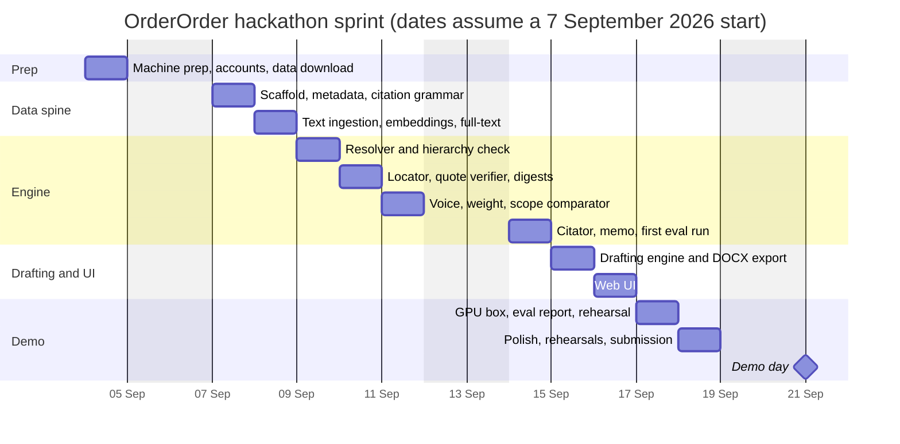
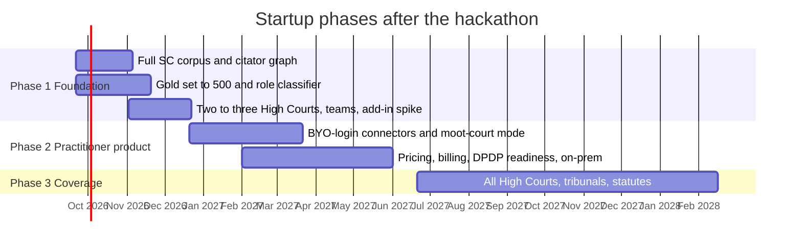

# OrderOrder — Roadmap

| | |
|---|---|
| **Version** | 0.1, draft |
| **Date** | 4 September 2026 |
| **Companion documents** | [PRD.md](PRD.md) · [ARCHITECTURE.md](ARCHITECTURE.md) · [TECH_STACK.md](TECH_STACK.md) |

Phase 0 is the hackathon sprint. Phases 1-3 take the same engine to a startup. Dates below assume the sprint starts Monday 7 September 2026; shift everything if the real start differs. Owners: **D** = developer, **L** = law-student co-founder.

---

## 1. Phase 0: hackathon sprint (10 working days)

### 1.1 Scope

**In:** Supreme Court judgments only (English, roughly 2014-2025, from AWS Open Data); Surface A end to end for failure modes 1, 2, 4, 5, 6, 8, 10, 12; Surface B for one matter type (a commercial contract / fraud dispute) with the verification gate; DOCX export; minimal web UI; a 50-item gold set; the demo memorial.

**Out:** High Courts; the fact comparator beyond a single structured call; the citator beyond Indian Kanoon cited-by and own extraction; bring-your-own-login connectors; Word add-in; teams and billing; the retrained role classifier.

### 1.2 Day-by-day plan

| Day | Developer (D) | Co-founder (L) | Exit criterion |
|---|---|---|---|
| **0** (prep, before the sprint) | Machine prep per [TECH_STACK.md](TECH_STACK.md) §9: free up the system drive, point Docker and Ollama at the data directory, install uv and Python 3.12. Indian Kanoon API token and non-commercial allowance request. Download the AWS Open Data SC parquet metadata and the 2014-2025 text. Book a GPU box for days 9-10. | Collect 5-10 real memorials with authors' permission. Choose the demo matter (contract fraud). Write the citation-format list (every reporter style seen in practice, with examples). | Data under `ORDERORDER_DATA_DIR`; memorials in hand |
| **1** | Monorepo scaffold; dev compose (postgres, redis, tei, ollama); Alembic schema for judgment, text version, paragraph, alias, edge, verdict. Ingest parquet metadata into `judgment` and `citation_alias`. Citation grammar v1 with tests generated from L's list. | Draft the 8-citation demo memorial: 2 clean, 1 phantom, 1 overstated, 1 dissent-as-holding, 1 overruled, 1 counsel-argument-as-holding, 1 wrong pinpoint. Record the expected verdict for each. | `orderorder resolve` finds every real citation in the demo memorial by exact alias |
| **2** | Text ingestion for the subset: Docling parse, paragraph segmentation, canonical IDs, opinion boundaries (rules), full-text index; start CPU embeddings overnight with BGE-M3. CLI `orderorder ingest`. | Gold set v0: 20 items covering modes 1, 2, 4, 8, 12 from the memorials; label with paragraph IDs from the viewer-less CLI dump. | Every judgment in the demo memorial and gold set is segmented with printed labels captured |
| **3** | Resolver: exact, neutral citation, fuzzy party names, Indian Kanoon lookup with stub caching and attribution; metadata and hierarchy check; abstention codes. | Precedent-hierarchy rules as a table (Article 141, bench strength, territorial HC rule, dissent, obiter). Written-submission template (synopsis, list of dates, issues, arguments, prayer, table of authorities). | Fabrication recall 100% on gold v0 |
| **4** | Locator: hybrid search within a judgment, reranker, candidate set with claimed pinpoint injected; quote verifier with normalisation and offsets; pinpoint reconciliation; digest builder on the 4B model for smoke tests. `orderorder verify` end to end for existence + location. | Gold set v1: extend to 50 items, adding modes 5, 6, 10; second-annotate 10 items. | Pinpoint hit@3 measured; quote-grounding 100% |
| **5** | Voice and opinion attribution; weight classifier (rule-assisted LLM); scope comparator: claim decomposition, NLI first pass, adjudicator schema with dropped qualifiers, modality, generality, narrowed proposition; selective-quotation check. | Review 20 engine verdicts against own judgment; write the opposing-counsel memo style guide with three worked examples. | Overstatement recall measured on gold v1 |
| **6** | Citator: own edges from ingested judgments + Indian Kanoon cited-by; treatment cue phrases + LLM; grade rubric; memo generation; first full eval run and retrieval tuning. | Label treatment for the gold set's mode-10 items; check the memo tone on 10 verdicts. | Eval report v1 with all P0 metrics |
| **7** | Drafting engine: case digest from uploaded documents (born-digital and one scanned page via PP-OCRv6), issue framing, authority retrieval and ranking, proposition drafting bound to paragraphs, gate policy, assembly from L's template, DOCX export with verification appendix. | Prepare the demo matter's documents (a contract, a notice, a reply, one scanned annexure) and the facts narrative; review the generated draft. | Draft exports with zero unverified propositions |
| **8** | Web UI: upload, verdict board with live progress, annotated brief, judgment viewer with paragraph highlight and version badge, memo panel, export; minimal drafting workspace (digest confirm, issues confirm, draft view, export). | Usability pass with two classmates on the stress-test flow; log confusions. | The demo script runs in the browser end to end on the laptop with the 4B model |
| **9** | Bring up the GPU box (SGLang, Qwen3.5-27B AWQ, TEI on GPU, PaddleOCR-VL); rebuild digests for the demo judgments; run the full eval; fix failures; verification report PDF; rehearsal 1 with timing. | Rehearsal 1 as presenter; tighten the narrative; prepare the hook slide (the July 2026 Supreme Court judgment; the "para 73 of 27" incident). | Demo under 7 minutes on the GPU box; eval report v2 |
| **10** | Polish; rehearsals 2 and 3; record a backup video of the full run; submission package (repo, docs, eval report, video). | Final Q&A prep: what the engine cannot do, why self-hosted, data sources and licences, roadmap. | Submitted |

### 1.3 Demo script ("catch the fake citation", about 7 minutes)

| Time | Beat |
|---|---|
| 0:00 | Hook: the Supreme Court's July 2026 words on advocates citing unverified AI precedents; the Delhi High Court petition that cited paragraphs 73-74 of a 27-paragraph judgment. "Nobody reads 300 pages per citation. We built the thing that does." |
| 0:45 | Upload the demo memorial. The verdict board fills in live: eight citations, eight grades. |
| 1:45 | Click the phantom: sources checked, nothing found, fix suggested. Click the overstated one: judgment viewer opens on the highlighted paragraph; the dropped qualifier and the narrowed proposition are shown side by side with the memorial's sentence. |
| 3:00 | Click the dissent-as-holding (opinion badge) and the overruled one (treating judgment and paragraph). Click the wrong pinpoint: "you cited para 23; the text is at para 19 in the official version". |
| 4:00 | Open the opposing-counsel memo for the weakest citation. Export the verification report. |
| 4:45 | Switch to Draft mode: the contract-fraud matter's digest, confirmed issues, verified propositions with badges, one gate warning, DOCX export with the verification appendix. |
| 6:15 | Close: gold-set metrics, fully self-hosted on open data, what comes next. |

### 1.4 Cut list, in order, if time runs short

1. Surface B reduced to one issue and no self-attack.
2. Fact comparator removed (mode 11 shown as "phase 1").
3. PDF report replaced by CSV export.
4. Annotated brief removed; verdict board only.
5. Indian Kanoon integration removed; the knowledge base alone decides existence, with an explicit "not in corpus" caveat instead of "phantom".

### 1.5 Risks specific to the sprint

| Risk | Mitigation |
|---|---|
| GPU box provisioning fails on day 9 | Book on day 0 and test SGLang once on day 4 for an hour; fall back to AWS Mumbai L4 |
| CPU embedding of the subset takes too long | Start on day 2 evening; embed only judgments from 2018 onward if needed |
| Citation grammar misses formats in the memorials | L's format list on day 0; tests drive the grammar; NER catches names without citations |
| Demo network failure | Backup video recorded on day 10; the whole stack runs on the laptop with reduced quality as a second fallback |

---

## 2. Gantt

---

## 3. Phase 1: Foundation (months 1-3 after the hackathon)

| Goal | Deliverable | Owner | Exit criterion |
|---|---|---|---|
| Full Supreme Court corpus | Ingest 1950-2025 from AWS Open Data; official PDFs for the most-cited 5,000 judgments; digests built in batches on the GPU box | D | Coverage report: every citation in the gold set resolves locally |
| Citator graph | Own citation-edge extraction across the corpus; treatment classifier trained on cue-phrase labels plus L's labels; Indian Kanoon cited-by merged | D, L | Treatment recall ≥ 90% on gold |
| Gold set to 500 | Items across all 12 modes; 20% double-annotated; agreement reported | L | Kappa reported; P1 metric targets in [PRD.md](PRD.md) §12 met |
| Retrained role classifier | InLegalBERT fine-tuned on OpenNyAI roles + LegalSeg; deployed with LLM fallback | D | Agreement with LLM labels ≥ 85%; ratio/obiter agreement with L ≥ 75% |
| High Courts | Two or three courts chosen by user demand (likely Delhi, Bombay, Punjab and Haryana) with per-court neutral-citation prefixes | D | Same metrics on an HC gold subset |
| Teams | Workspaces, roles, audit log, admin console | D | A moot society uses one workspace |
| Word add-in spike | Verify-from-Word prototype | D | Go/no-go decision |
| Indian Kanoon terms | Written confirmation on caching fetched documents | D | Letter on file |
| Users | Three moot societies onboarded; weekly interviews; verdict overrides flowing into the gold set | L | Catch-rate and override metrics published monthly |

---

## 4. Phase 2: Practitioner product (months 4-9)

| Goal | Deliverable | Exit criterion |
|---|---|---|
| Bring-your-own-login connectors | Browser extension that performs lookups on Manupatra / SCC Online inside the user's own session; no bulk retrieval; results shown, not stored beyond the session | Legal review sign-off; ten practitioners using it |
| Moot-court mode | Bench memorandum and likely bench questions generated from the verified draft and counter-authorities | Adopted by two moots |
| Pricing and billing | Student free tier; practitioner subscription in INR; firm seats; Razorpay | First paying practitioners |
| Compliance | DPDP-ready consent, deletion and records ahead of the 2027 obligations; privilege notice and cloud-toggle consent flow reviewed by counsel | Counsel sign-off |
| On-prem package | Single-box installer with the prod compose profile for firms | One firm pilot |
| Cloud toggle | Anthropic provider through the official SDK with citations; consent record; zero-retention and region check | Available to consenting matters only |

---

## 5. Phase 3: Coverage (months 10-18)

- All 25 High Courts from AWS Open Data, sharded by court; tribunals (NCLT, NCLAT, ITAT) from official portals.
- Statute and amendment tracking; statutory-provision verification against bare-act text; supersession detection in the citator.
- Regional-language OCR and judgment ingestion beyond English and Hindi.
- Public accuracy benchmark on an open Indian gold subset.

---

## 6. Team split and rituals

| | Developer | Co-founder |
|---|---|---|
| Owns | Pipeline, engine, UI, infrastructure, evaluation harness, model choices | Gold set and labels, citation-format list, precedent-hierarchy rules, written-submission template, memo style, demo memorial and matter, user interviews, legal review of terms |
| Daily | 15-minute sync: yesterday, today, blockers | Same |
| Weekly (after the hackathon) | Eval report review; retrieval or model changes only with a metric | User interview digest; override review |
| Decision rule | Engine changes must not lower any P0 metric | Labels are the ground truth; disagreements resolved by a second annotator |

---

## 7. Decision log

| Date | Decision | Reason |
|---|---|---|
| 2026-09-04 | Both surfaces in the MVP; verification engine is the core; drafting reuses it through a gate | Co-founder's problem statement is verification; the pipeline idea is drafting; one engine serves both |
| 2026-09-04 | Open and official data only; no Manupatra / SCC scraping | Their terms prohibit it; AWS Open Data is CC-BY-4.0 |
| 2026-09-04 | Fully self-hosted by default; cloud as a consented toggle | Privilege-waiver risk; DPDP; cost control |
| 2026-09-04 | Canonical paragraph IDs with text-version badges | Cross-reporter numbering is unresolved in the literature and was the hard ceiling in the Princeton benchmark |
| 2026-09-04 | Docling + PaddleOCR-VL; no PyMuPDF, MinerU, Marker, Surya | Licences |
| 2026-09-04 | Rhetorical roles by local LLM now, retrained InLegalBERT later | OpenNyAI package unmaintained; label set retained |
| 2026-09-04 | Postgres + pgvector only; Qdrant deferred | Corpus fits; one system for a team of two |
| 2026-09-04 | Demo on a rented India-resident GPU; laptop for development | Laptop is CPU-only with 16 GB RAM |
| 2026-09-04 | Named OrderOrder, repository `order-order` | The courtroom call to order; replaced the first draft's working name |
| Open | Trademark, domain and Bar Council advertising checks for the name | Needed before public launch, not before the hackathon |
| Open | Embedding model (BGE-M3 vs Qwen3-Embedding) | Decided on the gold set on sprint day 6 |
